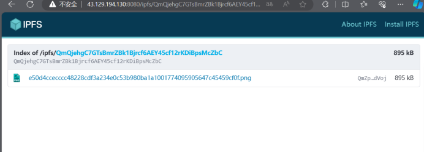

# NFT-Marketplace

上传IPFS成功证明:http://43.129.194.130:8080/ipfs/QmQjehgC7GTsBmrZBk1Bjrcf6AEY45cf12rKDiBpsMcZbC/


```bash
npm init -y
npm install express
npm install ejs
node app.js
npm install nodemon
npm i express-fileupload
npm i body-parser
npm i kubo-rpc-client
npm i ethers


npm install --save-dev @nomicfoundation/hardhat-toolbox
npm install --save-dev hardhat
npx hardhat

npx hardhat node

node app.js
```

使用 express.js 框架完成 2 个 API：

1. `/` ， get 方法，返回由 pug 模板引擎渲染的首页；
2. `/upload` post 方法，可以上传图片到 ipfs/生成 metadata 并上传到 ipfs/mint nft 给

固定地址；




